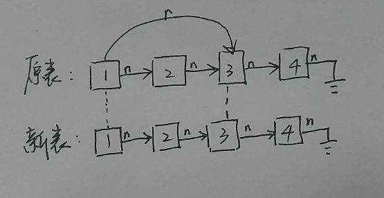
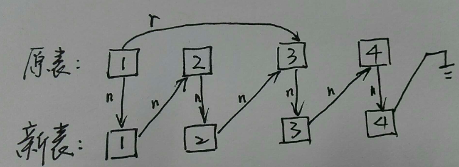

# Copy List with Random Pointer 题解

*原创文章，拒绝转载*

题目来源：https://leetcode.com/problems/copy-list-with-random-pointer/description/

------

## Description

A linked list is given such that each node contains an additional random pointer which could point to any node in the list or null.

Return a deep copy of the list.

## Solution
```cpp
/*
struct RandomListNode {
    int label;
    RandomListNode *next, *random;
    RandomListNode(int x) : label(x), next(NULL), random(NULL) {}
};
*/

class Solution {
public:
    RandomListNode *copyRandomList(RandomListNode *head) {
        if (head == NULL)
            return NULL;
        RandomListNode *node1, *node2;
        for (node1 = head; node1 != NULL; node1 = node1 -> next -> next) {
            node2 = new RandomListNode(node1 -> label);
            node2 -> next = node1 -> next;
            node1 -> next = node2;
        }

        RandomListNode* resNode = head -> next;
        for (node1 = head; node1 != NULL; node1 = node1 -> next -> next) {
            node2 = node1 -> next;
            node2 -> random = node1 -> random ? node1 -> random -> next : NULL;
        }

        for (node1 = head; node1 != NULL; node1 = node1 -> next) {
            node2 = node1 -> next;
            node1 -> next = node2 -> next;
            node2 -> next = node2 -> next ? node2 -> next -> next : NULL;
        }
        return resNode;
    }
};

```

------

## 解题描述

这道题目是关于链表深拷贝的变种。最难的一点就是不同于传统的链表，这道题中的链表每个节点会带有一个随机节点指针，指向链表中的任意一个节点。所以拷贝的时候，不仅要完成链表的顺序拷贝，还要完成在新的链表中随机节点指针的拷贝。

解题思路上，关键是如何保证新旧链表中的随机节点指针指向的节点的位置在新旧链表中是一样的。如果我们能够在进行随机节点的指向的复制的时候，知道新旧链表中当前节点还有当前节点指向的随机节点之间的一一对应关系，就可以完成随机指向关系的复制。



如图所示，如果要复制1号节点到3号节点的随机指向关系，需要我们知道新旧链表中，1号节点和3号节点的对应关系。

所以在进行相对简单的顺序拷贝之前，我们可以先考虑保存新旧链表中的节点一一对应的关系。这里可以采用一个做法：在顺序拷贝每一个节点之后，将节点插入到原来的链表中，相当于一个新旧链表的merge操作，在后期再进行原链表的恢复：



如图所示，这样我们在拷贝1号节点的随机指向时，就可以通过原链表1号节点指向的random节点的next节点找到新链表1号节点应该指向的对应节点。而在原链表中进行游标顺序移动的时候，只需要每一步多走一次next。后面节点的随机指向关系拷贝以此类推。

而链表的回复也相对简单，不做赘述。
