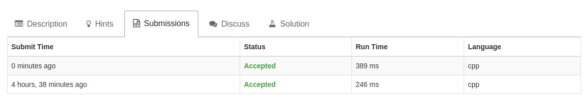

# Sort List题解

题目来源：https://leetcode.com/problems/sort-list/description/

------

## Description

Sort a linked list in O(n log n) time using constant space complexity.

## Solution
```C++
/**
 * Definition for singly-linked list.
 * struct ListNode {
 *     int val;
 *     ListNode *next;
 *     ListNode(int x) : val(x), next(NULL) {}
 * };
 */
 
class Solution {
public:

	int partition(vector<int>& arr, int low, int high) {
		int key = arr[low];

		while (low < high) {
			while (low < high && key <= arr[high])
				high--;
			if (low < high) {
				arr[low] = arr[high];
				low++;
			}
			while (low < high && key >= arr[low])
				low++;
			if (low < high) {
				arr[high] = arr[low];
				high--;
			}
		}
		arr[low] = key;

		return low;
	}

	void quickSort(vector<int>& arr, int start, int end) {
		int pos;
		if (start < end) {
			pos = partition(arr, start, end);
			quickSort(arr, start, pos - 1);
			quickSort(arr, pos + 1, end);
		}
		return;
	}

    ListNode* sortList(ListNode* head) {
    	if (head == NULL || head -> next == NULL) {
    		return head;
    	}

        ListNode* temp = head;
        vector<int> arr;

        while (temp != NULL) {
        	arr.push_back(temp -> val);
        	temp = temp -> next;
        }

        quickSort(arr, 0, arr.size() - 1);

        temp = head;
        int i = 0;
        while (temp != NULL) {
        	temp -> val = arr[i++];
        	temp = temp -> next;
        }

        return head;
    }
};

```

------

## 解题描述

这道题考察的是链表排序。我首先想到的是把链表里面的元素拷贝到一个vector里面然后再快排，这就跟平时对数组快排的操作一样了，然后写起来也比较好写。但是AC之后觉得，2次拷贝元素的时间会不会有点多？而且还带来了额外的空间开销。于是自己还是写多了一个针对链表的快排：

```C++
class Solution {
public:
    void swap(int& a, int& b) {
        int t = a;
        a = b;
        b = t;
    }

    ListNode* partition(ListNode* low, ListNode* high) {
        int key = low -> val;
        ListNode *locNode = low;  // the location node the that key will locate at last
        for (ListNode* tempNode = low -> next; tempNode != high; tempNode = tempNode -> next) {
            if (tempNode -> val < key) {
                locNode = locNode -> next;
                swap(locNode -> val, tempNode -> val);
            }
        }
        swap(low -> val, locNode -> val);
        return locNode;
    }

    void quickSort(ListNode* head, ListNode* tail) {
        ListNode* posNode;
        if (head != tail && head -> next != tail) {  // left close, right open interval
            posNode = partition(head, tail);
            quickSort(head, posNode);
            quickSort(posNode -> next, tail);
        }
        return;
    }

    ListNode* sortList(ListNode* head) {
        quickSort(head, NULL);
        return head;
    }
};
```

但是实际跑出来结果却是(后提交的是用链表快排)：

可能因为vector底层是用数组实现的，访问速度会比链表快一些，所以就算加上了拷贝元素的时间，总体的时间复杂度还是要低于直接对链表进行快排。

## 更优解法

**2018.2.3更新**

对链表来说，选择归并排序才是更明智的选择

- 链表无法像数组一样快速随机访问元素，要求排序算法元素访问次数较少且稳定
- 使用归并排序处理链表不需要像数组一样使用额外的内存，合并链表的时候只需要进行指针连接即可

下面给出链表递归归并排序的实现：

```cpp
class Solution {
private:
    ListNode* merge(ListNode* head1, ListNode* head2) {
        ListNode tempHead(0);
        ListNode *curNode = &tempHead;
        while (head1 && head2) {
            if (head1 -> val <= head2 -> val) {
                curNode -> next = head1;
                head1 = head1 -> next;
            } else {
                curNode -> next = head2;
                head2 = head2 -> next;
            }
            curNode = curNode -> next;
        }
        while (head1) {
            curNode -> next = head1;
            head1 = head1 -> next;
            curNode = curNode -> next;
        }
        while (head2) {
            curNode -> next = head2;
            head2 = head2 -> next;
            curNode = curNode -> next;
        }
        return tempHead.next;
    }
public:
    ListNode* sortList(ListNode* head) {
        if (!head)
            return NULL;
        if (head -> next == NULL)
            return head;
        if (head -> next -> next == NULL) {
            if (head -> val <= head -> next -> val) {
                return head;
            } else {
                ListNode *newHead = head -> next;
                newHead -> next = head;
                head -> next = NULL;
                return newHead;
            }
        }
        ListNode *mid = head, *tail = head;
        while (tail && tail -> next) {
            mid = mid -> next;
            tail = tail -> next -> next;
        }
        ListNode* head2 = sortList(mid -> next);
        mid -> next = NULL;
        head = sortList(head);
        return merge(head, head2);
    }
};
```